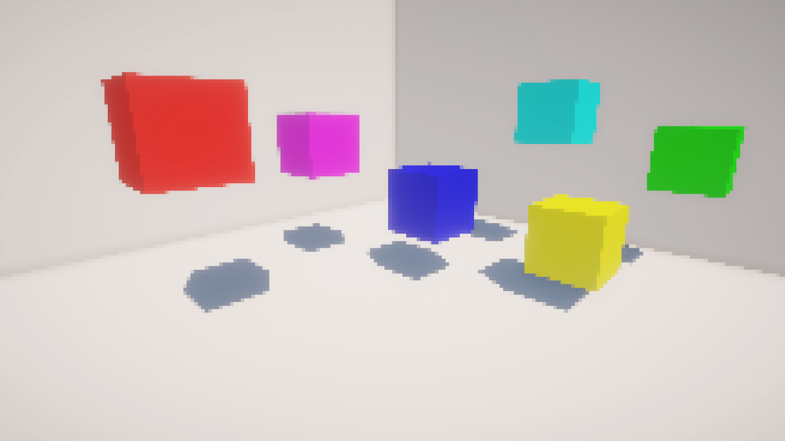

= Unity Downsampling
Melody Henrich

== What is it?

This is a simple downsampling fullscreen shader for Unity.
It contains only the basic functionality,
and applies universally to the whole screen.

== Controls

The resolution of the downsampling can be controlled via slider
in the Downsampling Material located in Effects > Downsampling.

== Thanks

+ [Game Dev Bill](https://gamedevbill.com/full-screen-shaders-in-unity/) - Fullscreen shader guide

== License

This is licensed under CC0.
